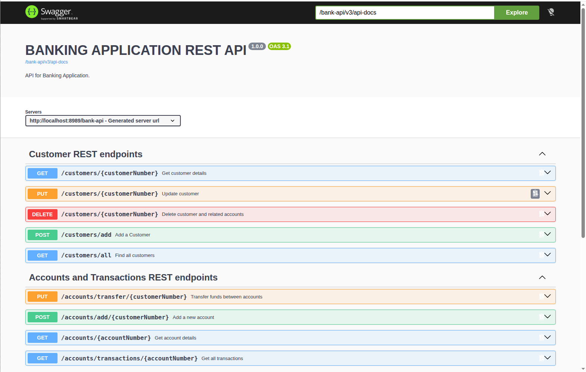
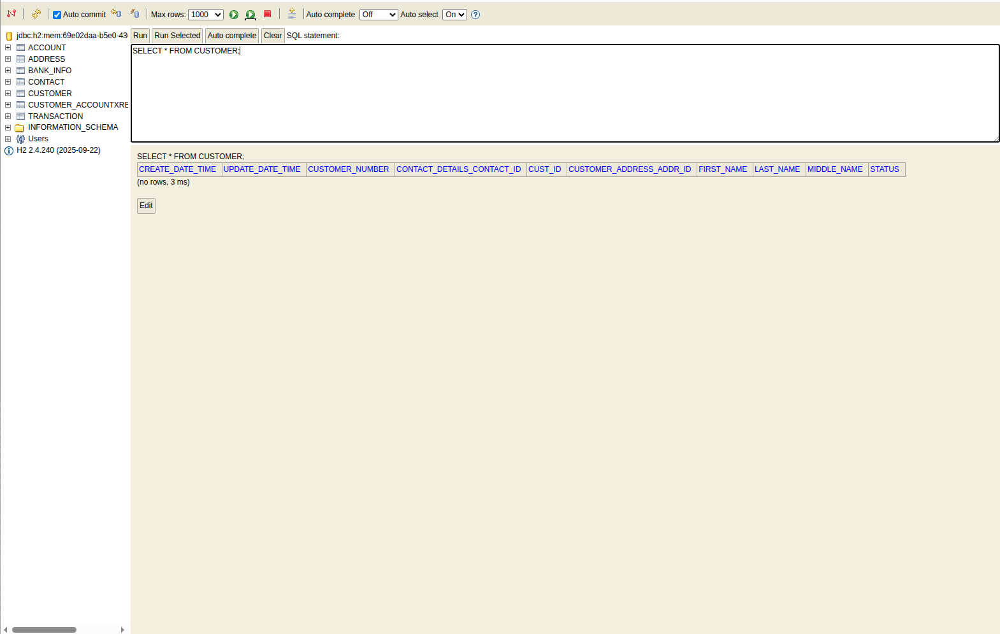

# Endpoint verification — JDK 21 / Spring Boot 4.1.1 (UNT2-10)

Branch `devin/1790153129-unt2-6-boot4` (head d66e97f), built with `mvn -B -DskipTests package` on
OpenJDK 21.0.12.1 and started with `java -jar target/bank-app-1.0.0.jar` (port 8989, context path
`/bank-api`). Raw curl output: [`endpoints-jdk21-boot4-curl.txt`](endpoints-jdk21-boot4-curl.txt).

| Check | Result |
| --- | --- |
| `GET /bank-api/swagger-ui/index.html` | 200 `text/html`; `/bank-api/swagger-ui.html` still 302-redirects to it, so the README URL is unchanged |
| `GET /bank-api/v3/api-docs` | 200; OpenAPI 3.1.0; `info.title` = `BANKING APPLICATION REST API`, description `API for Banking Application.`, version `1.0.0` (from `ApplicationConfig.customOpenAPI()`) |
| `@Tag` / `@Operation` rendering | tags `Customer REST endpoints` (5 ops) and `Accounts and Transactions REST endpoints` (4 ops), summaries intact |
| `GET /bank-api/h2-console/` | 200, **no `X-Frame-Options` header**; login with startup-log JDBC URL (`jdbc:h2:mem:<uuid>`, user `sa`, empty password) returns the console frameset; `SHOW TABLES` returns 7 tables, `SELECT * FROM CUSTOMER` runs in the browser |
| `GET /bank-api/actuator/health` | 200 `{"groups":["liveness","readiness"],"status":"UP"}`; `/health/liveness` and `/health/readiness` both `UP`; `/actuator` exposes only `health` (same as Boot 2.7) |

No code fix required; `README.md` URLs unchanged.

## Screenshots

### Swagger UI

### H2 console login (JDBC URL pre-filled from the startup log)

### H2 console query

### Actuator health

